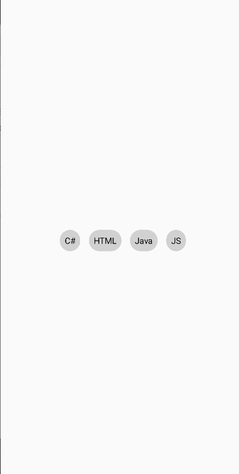

# How To Remove The Indicator Icon From The Xamarin.Forms SfChip

This example demonstrates how to hide the check icon while selecting the chip in Filter ChipGroup

[How to remove the indicator icon from Xamarin.Forms (SfChipGroup)](https://www.syncfusion.com/kb/11270/?utm_medium=listing&utm_source=github-examples)

To hide the selected chip selection indicator icon was achieved by adding the SfChip as the [ItemTemplate](https://help.syncfusion.com/cr/xamarin/Syncfusion.Buttons.XForms~Syncfusion.XForms.Buttons.SfChipGroup~ItemTemplate.html) of a ChipGroup. The default value of the SfChip&#39;s [ShowSelectionIndicator](https://help.syncfusion.com/xamarin/chips/customization#showselectionindicator) property is false. Since, the selection indicator icon will be hidden by default while using the SfChip as an ItemTemplate.

In addition, we have to set the Transparent color to the BackgroundColor and BorderColor of the Chip in the ItemTemplate. It will take the BackgroundColor from the [SelectedChipBackgroundColor](https://help.syncfusion.com/xamarin/chips/customization#selectedchipbackgroundcolor) and [ChipBackgroundColor](https://help.syncfusion.com/xamarin/chips/customization#chipbackgroundcolor) properties of ChipGroup. TextColor of the chips has been updated based on the [IsChecked](https://help.syncfusion.com/cr/xamarin/Syncfusion.Buttons.XForms~Syncfusion.XForms.Buttons.SfButton~IsChecked.html) value with [ChipTextColor](https://help.syncfusion.com/xamarin/chips/customization#chiptextcolor) and [SelectedChipTextColor](https://help.syncfusion.com/xamarin/chips/customization#selectedchiptextcolor) properties as per the following code example.

## Syncfusion Controls

This project uses the following Syncfusion controls:

* [SfChip](https://www.syncfusion.com/xamarin-ui-controls/xamarin-chips) - To show the sfchip and sfchipgroup.

## Screenshots
  

## Supported platforms

| Platforms | Supported versions |
| --------- | ------------------ |
| Android   | API level 19 and later versions |
| iOS | iOS 9.0 and later versions |

Refer to the following link for more details: 
[System Requirements](https://help.syncfusion.com/xamarin/installation-and-upgrade/system-requirements)

## Requirements to run the sample

* [Visual Studio 2017](https://visualstudio.microsoft.com/downloads/) or [Visual Studio for Mac](https://visualstudio.microsoft.com/vs/mac/)
* Xamarin add-ons for Visual Studio (available in Visual Studio installer)

## How to run the sample

1. Clone the sample and open it in Visual Studio.

   *Note: If you download the sample using the "Download ZIP" option, right-click it, select Properties, and then select Unblock.*

2. Register your license key in the App.cs file as demonstrated in the following code.

        public App()
        {
            //Register Syncfusion license
            Syncfusion.Licensing.SyncfusionLicenseProvider.RegisterLicense("YOUR LICENSE KEY");

            InitializeComponent();

            MainPage = new NavigationPage(new MainPage());
        }

Refer to this [link](https://help.syncfusion.com/common/essential-studio/licensing/license-key#xamarinforms) for more details.

3. Set any one of the platform specific projects (iOS, Android or UWP) as a start-up project.
4. Clean and build the application.
5. Run the application.

## License

Syncfusion has no liability for any damage or consequence that may arise by using or viewing the samples. The samples are for demonstrative purposes, and if you choose to use or access the samples, you agree to not hold Syncfusion liable, in any form, for any damage that is related to use, for accessing, or viewing the samples. By accessing, viewing, or seeing the samples, you acknowledge and agree Syncfusion’s samples will not allow you seek injunctive relief in any form for any claim related to the sample. If you do not agree to this, do not view, access, utilize, or otherwise do anything with Syncfusion’s samples.

